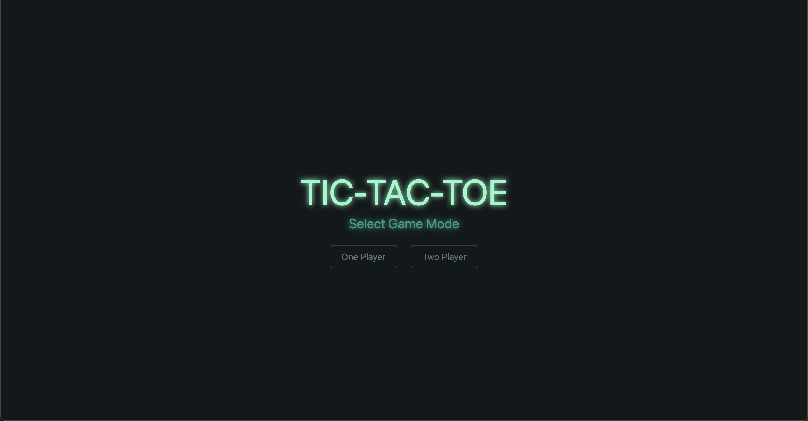
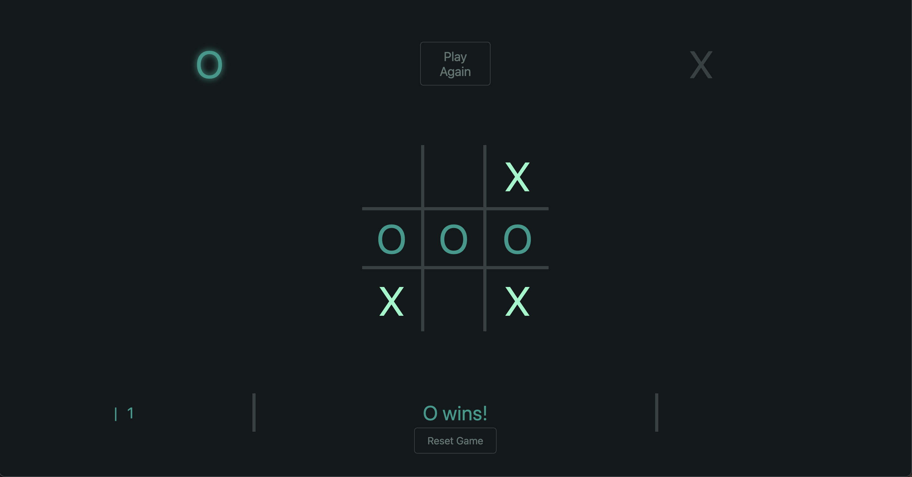
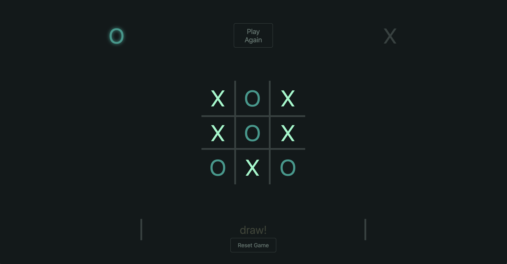

# Tic Tac Toe
A simple take on the classic Tic Tac Toe game, designed for both one-player and two-player modes. In One-Player Mode, try your luck against a computer AI that will block your winning moves and try to win itself. In Two-Player Mode, challenge a friend to see who wins!

### Technologies Used
+ JavaScript for game logic, including handling turns, detecting wins, and AI movement.
+ HTML for structuring the game board.
+ CSS for styling the game interface, with smooth animations for marking the board.

### Project Duration
3 days

### Challenges & Key Features:
+ AI Logic: Developed an AI capable of blocking the player’s moves and making strategic decisions.
+ Smooth Animations: Added CSS transitions for a visually appealing game experience.
+ Responsive Design: Ensured the game works on both desktop and mobile.

### Future Improvements:
+ Add different difficulty levels for the AI.
+ Implement persistent game history.
+ Introduce a timer feature for an added challenge.

### Live Demo: [Play the Game](https://xokeesh.github.io/Tic-Tac-Toe/)

### Game Mode Selection

### Game Start

### X Wins

### O Wins

### Game Draw
